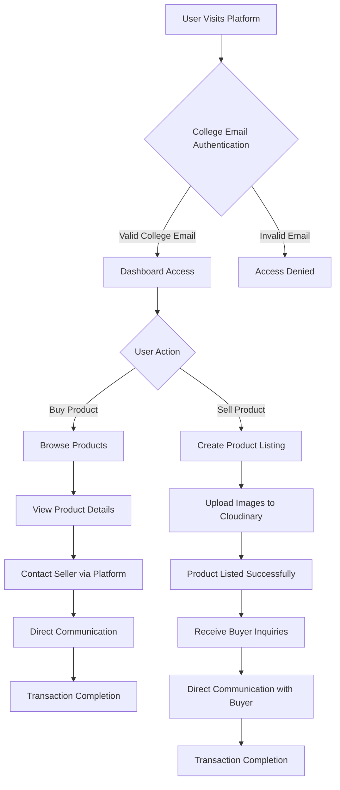

# CGU-LX - College Marketplace Platform

A comprehensive marketplace platform designed specifically for college students to buy and sell products within their campus community. Built with modern web technologies to provide a seamless and secure trading experience.

## 🚀 Tech Stack

### Frontend
- **React 19** - Modern JavaScript library for building user interfaces
- **Firebase 11** - Authentication and real-time database
- **Tailwind CSS 4** - Utility-first CSS framework
- **Radix UI** - Accessible UI components
- **Framer Motion** - Animation library
- **React Router DOM** - Client-side routing
- **Axios** - HTTP client for API requests
- **Lucide React** - Icon library
- **React Hot Toast** - Notification system
- **Vercel Analytics** - Web analytics
- **React GA4** - Google Analytics integration

### Backend
- **Node.js** - JavaScript runtime
- **Express.js** - Web application framework
- **MongoDB** - NoSQL database with Mongoose ODM
- **Firebase Admin** - Server-side Firebase operations
- **JWT** - JSON Web Tokens for authentication
- **bcrypt** - Password hashing
- **Cloudinary** - Image storage and optimization
- **Multer** - File upload handling
- **Nodemailer** - Email service
- **Twilio** - WhatsApp OTP verification
- **Redis** - Caching layer
- **PostgreSQL** - Relational database with Sequelize ORM

## 🔄 User Flow Diagram



## 🎯 Benefits & Use Case

### Problem Solved
Previously, college students faced significant challenges when buying or selling products:
- **Long Communication Chains**: Students had to rely on multiple intermediaries (friends, seniors, juniors) to find buyers/sellers
- **Trust Issues**: No verification system led to potential scams and unreliable transactions
- **Limited Reach**: Products could only be advertised within immediate social circles
- **Moving Students**: Students leaving hostels often struggled to sell belongings quickly

### Solution Benefits
- **Direct Platform**: Single, centralized marketplace for all college trading needs
- **Verified Users**: College email authentication ensures only legitimate students participate
- **Secure Communication**: Built-in messaging system for buyer-seller interactions
- **Wide Reach**: Access to entire college community instead of limited social circles
- **Quick Transactions**: Streamlined process from listing to sale completion
- **Trust Building**: User profiles and review system enhance credibility
- **Convenience**: Easy-to-use interface optimized for mobile and desktop

### Target Users
- Current college students looking to buy second-hand items
- Students moving out of hostels needing to sell belongings
- Students seeking affordable alternatives to new purchases
- Campus community members wanting to monetize unused items


## 🚀 Getting Started

### Prerequisites
- Node.js (v16 or higher)
- MongoDB
- Firebase project setup
- Cloudinary account for image storage

### Installation

1. **Clone the repository**
   ```bash
   git clone <repository-url>
   cd CGU-LX
   ```

2. **Setup Backend**
   ```bash
   cd backend
   npm install
   # Configure environment variables in .env
   npm run dev
   ```

3. **Setup Frontend**
   ```bash
   cd ../frontend
   npm install
   npm start
   ```

## 📧 Contact

For questions or support, reach out to:
- **Email**: cgumarketplace@gmail.com  

<p align="center">
  <a href="https://github.com/ankmay0">
    
  </a>
  <br/>
  <b>Mayank Kumar(Initiator)</b>
</p>


## 👨‍💻 Contributors

Thanks to these awesome people who made this project possible 💖

<p>
  <a href="https://github.com/DeepshikhaKeshri">
    
  </a>
  <a href="https://github.com/Tusharkanta407">
    
  </a>
  <a href="https://github.com/shankhanraman">
    
  </a>
  <a href="https://github.com/soumya99999">
    
  </a>
  <a href="https://github.com/Jivan-Jala">
    
  </a>
  <a href="https://github.com/Priya24-ux">
    
  </a>
</p>

---

*Built with ❤️ for the college community*

